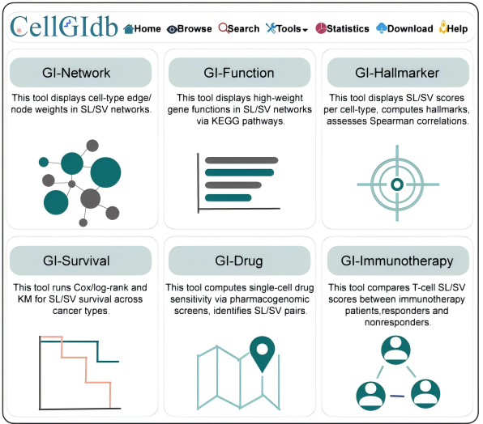

# CellGIdb

## Introduction

CellGIdb is a comprehensive data portal that enables users to query and visualize cell-type-specific SL and SV networks. The database integrates:

- **93,473 SL** and **14,038 SV** interactions from CGIdb 2.0
- **1,086,649 cells** from 42 single-cell datasets across 14 cancer types
- **2,693 drugs** and **694 cancer samples** treated with immune checkpoint inhibitors (ICIs)

For each single-cell dataset, we perform data processing and quality control, followed by the selection of cell-type-specific SL and SV networks. To facilitate the interpretation of these networks, CellGIdb provides six functional tools:

- **GI-Network**
- **GI-Function**
- **GI-Hallmarker**
- **GI-Survival**
- **GI-Drug**
- **GI-Immunotherapy**

## Results

We present a case study using malignant epithelial cells from the lung cancer dataset GSE149655. The analysis includes:

1. Identification of cell type-specific Synthetic Lethal (SL) and Synthetic Viable (SV) networks (see [`1-cell-type-specific_SL_and_SV.R`](1-cell-type-specific_SL_and_SV.R)).
2. Identification of SL and SV interactions associated with immunotherapy response and cancer patient prognosis.
3. Calculation of the Drug Sensitivity Score (DDS) for each cell (see [`2-SL-SV-tool.R`](2-SL-SV-tool.R)).

## Authors

- Mingyue Liu  
- Yu Tian  
- Nan Zhang